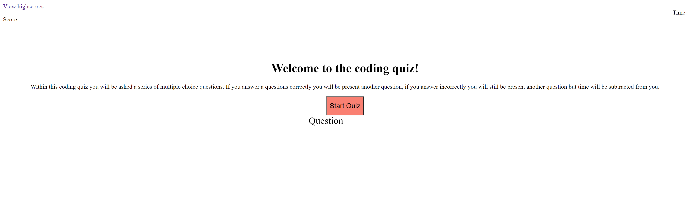

Creating a coding quiz. For just this test care i only created two questions and
was able to interate through the questions and answer list. I was able to subtract time when a question is marked wrong and then also i was able to have and end game function that records the user name and saves it local data.

SS : 

Link to deployed application: https://yilmazv.github.io/QuizGame/
